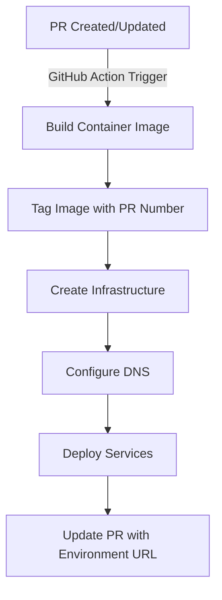
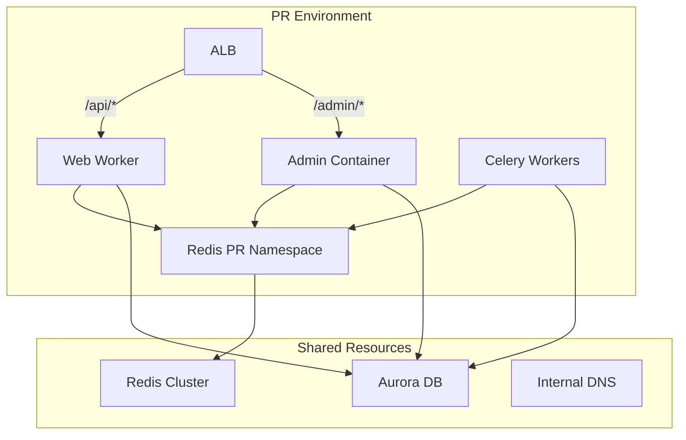
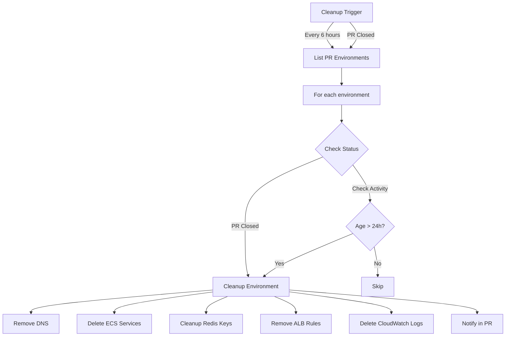

# RFC: Branch-Based Deployments for monolithic API

## 1. Introduction

This RFC proposes a solution for implementing branch-based deployments for a monolithic API. The current infrastructure only supports single-version deployments for production and staging environments. The proposed solution will enable developers to create isolated, branch-specific environments for testing their pull requests, significantly improving the development workflow.

## 2. Proposed Solution

### 2.1 Overview

The solution implements a dynamic environment creation system using Amazon ECS, where each PR spawns its own isolated stack of services. The implementation leverages existing infrastructure while providing isolation for testing, with the following key aspects:

1. **Infrastructure Foundation**
   - Amazon ECS on EC2 for containerized services
   - Application Load Balancers for traffic management
   - Cloudflare for DNS and security
   - Redis for caching and queues

2. **Environment Isolation**
   - PR-specific services
   - Namespace isolation for shared resources
   - Independent scaling capabilities
   - Automated lifecycle management

3. **Cost Optimization**
   - Time-based scaling
   - Resource sharing where appropriate
   - Automated cleanup
   - Optimized instance sizing

### 2.2 Infrastructure Configuration

#### 2.2.1 Network Architecture

1. **VPC Setup**
   - Dedicated VPC for PR environments
   - Minimum of two public subnets across different AZs
   - Minimum of two private subnets across different AZs
   - NAT Gateway for private subnet internet access
   - VPC endpoints for ECR and CloudWatch Logs

2. **Load Balancer Configuration**
   - Application Load Balancer in public subnets
   - SSL/TLS termination at ALB
   - Host-based routing for PR environments
   - Path-based routing for services within each PR

3. **Cloudflare Integration**
   
   **DNS Configuration**
   ```yaml
   # Primary DNS Record
   Type: A
   Name: *.api.internal
   Value: ${ALB_DNS_NAME}
   Proxy status: Proxied
   TTL: Auto

   # Internal Resolution Record
   Type: CNAME
   Name: *.api.internal
   Value: ${ALB_DNS_NAME}
   Proxy status: DNS only
   TTL: 1 minute
   ```

   **Security Configuration**
   - Full (Strict) SSL/TLS mode
   - Origin server SSL certificate from AWS Certificate Manager
   - Cloudflare Origin CA certificate installed on ALB
   - Edge certificates for `*.api.internal` domain
   - Access policies:
     - IP allowlisting for VPN ranges
     - Optional Zero Trust policies
     - PR-specific access rules

4. **Security Groups**
   ```yaml
   LoadBalancerSG:
     Ingress:
       - FromPort: 443
         ToPort: 443
         Protocol: tcp
         CidrIp: ${CLOUDFLARE_IP_RANGES}  # Cloudflare IP ranges
   
   ServiceSG:
     Ingress:
       - FromPort: 8000
         ToPort: 8000
         Protocol: tcp
         SourceSecurityGroupId: ${LoadBalancerSG}
   ```

#### 2.2.2 ECS Configuration

1. **Task Definitions**
Base task definition template for all services:
```json
{
  "family": "pr-${PR_NUMBER}-${SERVICE}",
  "networkMode": "bridge",
  "requiresCompatibilities": ["EC2"],
  "placementConstraints": [
    {
      "type": "memberOf",
      "expression": "attribute:environment == pr-environments"
    }
  ],
  "containerDefinitions": [
    {
      "name": "${SERVICE}",
      "image": "${ECR_REPO}:pr-${PR_NUMBER}",
      "essential": true,
      "portMappings": [
        {
          "hostPort": 0,  // Dynamic port mapping
          "containerPort": 8000,
          "protocol": "tcp"
        }
      ],
      "environment": [
        {
          "name": "PR_NUMBER",
          "value": "${PR_NUMBER}"
        },
        {
          "name": "SERVICE_TYPE",
          "value": "${SERVICE}"
        }
      ],
      "healthCheck": {
        "command": [
          "CMD-SHELL",
          "curl -f http://localhost:8000/health || exit 1"
        ],
        "interval": 30,
        "timeout": 5,
        "retries": 3,
        "startPeriod": 60
      },
      "logConfiguration": {
        "logDriver": "awslogs",
        "options": {
          "awslogs-group": "/ecs/pr-environments",
          "awslogs-region": "${AWS_REGION}",
          "awslogs-stream-prefix": "pr-${PR_NUMBER}"
        }
      }
    }
  ]
}
```

2. **Service Configuration**
Template for ECS services:
```yaml
ECSService:
  Type: AWS::ECS::Service
  Properties:
    ServiceName: pr-${PR_NUMBER}-${SERVICE}
    Cluster: pr-environments
    TaskDefinition: ${TASK_DEFINITION_ARN}
    DesiredCount: 1
    LaunchType: EC2
    PlacementConstraints:
      - Type: memberOf
        Expression: "attribute:environment == pr-environments"
    PlacementStrategy:
      - Type: spread
        Field: instanceId
      - Type: binpack
        Field: memory
    NetworkConfiguration:
      ContainerName: ${SERVICE}
      ContainerPort: 8000
      HostPort: 0  # Dynamic port mapping for EC2
    DeploymentConfiguration:
      MinimumHealthyPercent: 50
      MaximumPercent: 100
    Tags:
      - Key: PRNumber
        Value: ${PR_NUMBER}
      - Key: Service
        Value: ${SERVICE}
    # Additional EC2-specific configurations
    EnableExecuteCommand: true
    PropagateTags: SERVICE

# EC2 Specific Auto Scaling Configuration
ECSServiceAutoScalingTarget:
  Type: AWS::ApplicationAutoScaling::ScalableTarget
  Properties:
    MaxCapacity: 3
    MinCapacity: 1
    ResourceId: !Sub service/${ECSCluster}/${ECSService.Name}
    RoleARN: ${AUTO_SCALING_ROLE_ARN}
    ScalableDimension: ecs:service:DesiredCount
    ServiceNamespace: ecs

ECSServiceScalingPolicy:
  Type: AWS::ApplicationAutoScaling::ScalingPolicy
  Properties:
    PolicyName: pr-${PR_NUMBER}-${SERVICE}-scaling-policy
    PolicyType: TargetTrackingScaling
    ScalingTargetId: !Ref ECSServiceAutoScalingTarget
    TargetTrackingScalingPolicyConfiguration:
      PredefinedMetricSpecification:
        PredefinedMetricType: ECSServiceAverageCPUUtilization
      ScaleInCooldown: 60
      ScaleOutCooldown: 60
      TargetValue: 70.0  # Target 70% CPU utilization
```

### 2.3 Core Components

#### Environment Naming and Structure
- Each branch environment follows the naming convention: `pr-{number}-{service}`
- Example: `pr-123-web`, `pr-123-celery-default`
- All related resources use this prefix for easy identification and cleanup
- Consistent tagging strategy for cost allocation and resource management

#### Service Implementation

1. **Web Worker (API)**
   - Dedicated ALB listener rules
   - Custom DNS entry: `pr-{number}.api.internal`
   - Scaled down instance count (1)
   - Path-based routing: `/api/*`
   - Health check endpoint: `/api/health`
   - Container configuration:
     ```yaml
     Command: ["./run_api.sh"]
     Environment:
       - DJANGO_SETTINGS_MODULE=config.settings.development
       - PR_NUMBER=${PR_NUMBER}
       - SERVICE_TYPE=api
     ```

2. **Admin Container**
   - Shares ALB with API
   - Path-based routing: `/admin/*`
   - Health check endpoint: `/admin/health`
   - Container configuration:
     ```yaml
     Command: ["./run_admin.sh"]
     Environment:
       - DJANGO_SETTINGS_MODULE=config.settings.development
       - PR_NUMBER=${PR_NUMBER}
       - SERVICE_TYPE=admin
     ```

3. **Celery Workers**
   - Three worker types: default, async, low-priority
   - PR-specific Redis queue prefixes
   - Container configuration:
     ```yaml
     Command: ["./run_celery.sh", "${QUEUE_TYPE}"]
     Environment:
       - CELERY_QUEUE_TYPE=${QUEUE_TYPE}
       - PR_NUMBER=${PR_NUMBER}
       - SERVICE_TYPE=celery
     ```

### 2.4 CI/CD Workflow

The CI/CD implementation consists of three GitHub Actions workflows:

1. **PR Environment Deployment** (.github/workflows/pr-environment.yml)
```yaml
name: PR Environment Deployment

on:
  pull_request:
    types: [opened, synchronize, reopened]
    paths:
      - '/path-to-src'
  issue_comment:
    types: [created]

env:
  AWS_REGION: us-east-1
  ECR_REPOSITORY: monolithic-api
  ECS_CLUSTER: pr-environments
  PR_NUMBER: ${{ github.event.pull_request.number }}

jobs:
  check_deployment_needed:
    runs-on: ubuntu-latest
    if: |
      (github.event_name == 'pull_request') ||
      (github.event_name == 'issue_comment' && 
       github.event.issue.pull_request && 
       contains(github.event.comment.body, '/deploy'))
    outputs:
      should_deploy: ${{ steps.check.outputs.should_deploy }}
    steps:
      - id: check
        run: |
          if [[ "${{ github.event_name }}" == "issue_comment" && 
                "${{ github.event.comment.body }}" == "/deploy" ]]; then
            echo "should_deploy=true" >> $GITHUB_OUTPUT
          elif [[ "${{ github.event_name }}" == "pull_request" ]]; then
            echo "should_deploy=true" >> $GITHUB_OUTPUT
          else
            echo "should_deploy=false" >> $GITHUB_OUTPUT
          fi

  deploy:
    needs: check_deployment_needed
    if: needs.check_deployment_needed.outputs.should_deploy == 'true'
    runs-on: ubuntu-latest
    steps:
      - uses: actions/checkout@v3

      - name: Configure AWS credentials
        uses: aws-actions/configure-aws-credentials@v1
        with:
          aws-access-key-id: ${{ secrets.AWS_ACCESS_KEY_ID }}
          aws-secret-access-key: ${{ secrets.AWS_SECRET_ACCESS_KEY }}
          aws-region: ${{ env.AWS_REGION }}

      - name: Login to Amazon ECR
        id: login-ecr
        uses: aws-actions/amazon-ecr-login@v1

      - name: Build, tag, and push image to Amazon ECR
        env:
          ECR_REGISTRY: ${{ steps.login-ecr.outputs.registry }}
          IMAGE_TAG: pr-${{ github.event.pull_request.number }}
        run: |
          docker build -t $ECR_REGISTRY/$ECR_REPOSITORY:$IMAGE_TAG .
          docker push $ECR_REGISTRY/$ECR_REPOSITORY:$IMAGE_TAG

      - name: Deploy PR Environment
        run: |
          python3 scripts/deploy_pr_environment.py \
            --pr-number ${{ github.event.pull_request.number }} \
            --image $ECR_REGISTRY/$ECR_REPOSITORY:$IMAGE_TAG

      - name: Update PR
        uses: actions/github-script@v6
        with:
          script: |
            const domain = `pr-${process.env.PR_NUMBER}.api.internal`;
            const comment = `
            🚀 PR Environment deployed!
            
            Access your environment at:
            - API: https://${domain}/api
            - Admin: https://${domain}/admin
            
            Additional commands:
            - \`/deploy\`: Redeploy environment
            - \`/cleanup\`: Clean up environment
            - \`/restart\`: Restart services
            
            Environment will auto-cleanup after 24h of inactivity.
            `;
            
            github.rest.issues.createComment({
              owner: context.repo.owner,
              repo: context.repo.repo,
              issue_number: process.env.PR_NUMBER,
              body: comment
            });
```

2. **Manual Control Workflow** (.github/workflows/pr-controls.yml)
```yaml
name: PR Environment Manual Controls

on:
  issue_comment:
    types: [created]

env:
  AWS_REGION: us-east-1
  ALLOWED_COMMANDS: /deploy,/cleanup,/restart

jobs:
  process_command:
    # Only runs on PR comments, not regular issue comments
    name: Process PR Comment Command
    if: |
      github.event.issue.pull_request && 
      contains(env.ALLOWED_COMMANDS, github.event.comment.body)
    runs-on: ubuntu-latest
    steps:
      - uses: actions/checkout@v3

      - name: Configure AWS credentials
        uses: aws-actions/configure-aws-credentials@v1
        with:
          aws-access-key-id: ${{ secrets.AWS_ACCESS_KEY_ID }}
          aws-secret-access-key: ${{ secrets.AWS_SECRET_ACCESS_KEY }}
          aws-region: ${{ env.AWS_REGION }}

      - name: Execute Command
        run: |
          # Get PR number from the comment context
          PR_NUMBER=$(gh pr view ${{ github.event.issue.number }} --json number -q .number)
          
          case "${{ github.event.comment.body }}" in
            "/deploy")
              python3 scripts/deploy_pr_environment.py --pr-number $PR_NUMBER
              ;;
            "/cleanup")
              python3 scripts/cleanup_pr_environment.py --pr-number $PR_NUMBER
              ;;
            "/restart")
              python3 scripts/restart_pr_environment.py --pr-number $PR_NUMBER
              ;;
          esac
        env:
          GITHUB_TOKEN: ${{ secrets.GITHUB_TOKEN }}

      - name: Update PR
        if: success()
        uses: actions/github-script@v6
        with:
          script: |
            const command = '${{ github.event.comment.body }}'.replace('/', '');
            const comment = `✅ ${command} command completed successfully.`;
            
            github.rest.issues.createComment({
              owner: context.repo.owner,
              repo: context.repo.repo,
              issue_number: context.issue.number,
              body: comment
            });

      - name: Report Failure
        if: failure()
        uses: actions/github-script@v6
        with:
          script: |
            const command = '${{ github.event.comment.body }}'.replace('/', '');
            const comment = `❌ ${command} command failed. Please check the workflow logs for details.`;
            
            github.rest.issues.createComment({
              owner: context.repo.owner,
              repo: context.repo.repo,
              issue_number: context.issue.number,
              body: comment
            });
```
3. **PR environment cleanup** (.github/workflows/pr-cleanup.yml)
```yaml
name: PR Environment Cleanup

on:
  schedule:
    - cron: '0 */6 * * *'  # Run every 6 hours
  workflow_dispatch:        # Allow manual triggers

env:
  AWS_REGION: us-east-1
  ECS_CLUSTER: pr-environments

jobs:
  cleanup-check:
    runs-on: ubuntu-latest
    steps:
      - uses: actions/checkout@v3

      - name: Configure AWS credentials
        uses: aws-actions/configure-aws-credentials@v1
        with:
          aws-access-key-id: ${{ secrets.AWS_ACCESS_KEY_ID }}
          aws-secret-access-key: ${{ secrets.AWS_SECRET_ACCESS_KEY }}
          aws-region: ${{ env.AWS_REGION }}

      - name: Find Stale Environments
        id: find-stale
        run: |
          # Get list of active PR environments
          ENVIRONMENTS=$(aws ecs list-services --cluster ${ECS_CLUSTER} \
            --query 'serviceArns[*]' --output text | grep -o 'pr-[0-9]*-' | sort -u)
          
          for ENV in $ENVIRONMENTS; do
            PR_NUMBER=$(echo $ENV | grep -o '[0-9]*')
            
            # Check if PR is closed
            PR_STATE=$(gh pr view $PR_NUMBER --json state -q .state || echo "closed")
            
            # Check last activity timestamp
            LAST_ACTIVITY=$(aws logs get-log-events \
              --log-group-name "/ecs/pr-environments" \
              --log-stream-name "pr-${PR_NUMBER}-web" \
              --limit 1 --query 'events[0].timestamp' --output text || echo "0")
            
            # Calculate age in hours
            CURRENT_TIME=$(date +%s%3N)
            AGE_HOURS=$(( ($CURRENT_TIME - $LAST_ACTIVITY) / (1000 * 60 * 60) ))
            
            if [ "$PR_STATE" = "closed" ] || [ $AGE_HOURS -gt 24 ]; then
              echo "Cleaning up PR-${PR_NUMBER} (State: ${PR_STATE}, Age: ${AGE_HOURS}h)"
              python3 scripts/cleanup_pr_environment.py --pr-number $PR_NUMBER
              
              if [ "$PR_STATE" = "open" ]; then
                gh pr comment $PR_NUMBER --body "🧹 Environment automatically cleaned up due to 24h of inactivity. Use \`/deploy\` to recreate it."
              fi
            fi
          done
        env:
          GITHUB_TOKEN: ${{ secrets.GITHUB_TOKEN }}
```

## 3. Technical Design

### 3.1 Deployment Process

1. **Environment Creation Flow**


2. **Service Dependencies**


### 3.2 Resource Management

#### 3.2.1 Database Access
- Shared Aurora cluster across  PR environments
- Connection pooling per environment
- Transaction isolation through application logic
- Read replicas for heavy queries

#### 3.2.2 Redis Implementation
```python
# Configuration for Redis namespacing
REDIS_PREFIX = f"pr-{os.getenv('PR_NUMBER')}"

# Celery queue configuration
CELERY_CONFIG = {
    "broker_url": f"redis://{REDIS_HOST}:{REDIS_PORT}/0",
    "task_default_queue": f"{REDIS_PREFIX}-default",
    "task_default_exchange": f"{REDIS_PREFIX}-exchange",
    "task_default_routing_key": f"{REDIS_PREFIX}-default",
    "task_queues": {
        f"{REDIS_PREFIX}-default": {"exchange": f"{REDIS_PREFIX}-exchange"},
        f"{REDIS_PREFIX}-async": {"exchange": f"{REDIS_PREFIX}-exchange"},
        f"{REDIS_PREFIX}-low": {"exchange": f"{REDIS_PREFIX}-exchange"}
    }
}

# Cache configuration
CACHES = {
    "default": {
        "BACKEND": "django_redis.cache.RedisCache",
        "LOCATION": f"redis://{REDIS_HOST}:{REDIS_PORT}/0",
        "OPTIONS": {
            "CLIENT_CLASS": "django_redis.client.DefaultClient",
            "KEY_PREFIX": REDIS_PREFIX
        }
    }
}
```

### 3.3 Scaling and Cost Management

#### 3.3.1 Operating Hours
- Full capacity covering US West Coast -> Egypt: 19 hours (9AM EET to 5PM PST)
- Reduced capacity: 5 hours (5PM PST to 9AM EET)
- Automated scaling based on time zones

#### 3.3.2 Cost Optimization
1. **Daily Cost Breakdown**

| Service | Full Capacity (19h) | Reduced Capacity (5h) | Daily Total |
|---------|-------------------|---------------------|-------------|
| Web Worker | $0.399 | $0.105 | $0.504 |
| Admin Container | $0.399 | $0 | $0.399 |
| Celery Workers | $1.197 | $0 | $1.197 |
| ALB | $0.532 | $0.140 | $0.672 |
| **Total** | **$2.51** | **$0.245** | **$2.755** |

2. **Monthly Estimation**
- Active PRs per day: 10
- Working days: 21
- Monthly cost: `$2.755 × 10 × 21 = $578.55`

#### 3.3.2 Cleanup system diagram



# 4. Deployment and developer usage guide

## Deployment Workflow

### 1. Creating a New Branch
```bash
# Create and switch to a new feature branch
git checkout -b feature/my-awesome-feature

# Make your changes
# Commit and push your changes
git add .
git commit -m "Implement new feature"
git push -u origin feature/my-awesome-feature
```

### 2. Triggering PR Environment Deployment

#### Automatic Deployment
- Simply opening a pull request will automatically trigger the deployment
- GitHub Actions will:
  1. Build your container image
  2. Tag it with the PR number
  3. Deploy to the PR environment
  4. Comment on the PR with environment access details

#### Manual Deployment Trigger
If automatic deployment fails or you need to redeploy:
- Comment `/deploy` directly on the pull request

### 3. Accessing Your PR Environment

#### Environment URL
- Each PR gets a unique environment URL
- Format: `https://pr-{PR_NUMBER}.api.internal`

#### Available Endpoints
1. **API Endpoint:** `https://pr-{PR_NUMBER}.api.internal/api`
2. **Admin Interface:** `https://pr-{PR_NUMBER}.api.internal/admin`

#### Authentication
- Temporary basic auth credentials will be provided in the PR comment
- These credentials are unique to your PR environment

### 4. Debugging and Monitoring

#### Logs

A link to Cloudwatch or Datadog will be provide in the PR comments.

#### Health Checks
- Each service exposes a `/health` endpoint
- Automatically monitored by load balancer
- Can be manually checked via:
  ```bash
  curl https://pr-{PR_NUMBER}.api.internal/api/health
  curl https://pr-{PR_NUMBER}.api.internal/admin/health
  ```

### 5. Environment Management Commands

#### Available PR Environment Commands
- `/deploy`: Redeploy the entire environment
- `/restart`: Restart all services
- `/cleanup`: Manually remove the PR environment

**Note:** Environments are automatically cleaned up after:
- 24 hours of inactivity
- PR is closed or merged

### 6. Best Practices

#### Cost and Resource Management
- Keep PR environments lean
- Use `/cleanup` when no longer needed
- Avoid leaving multiple long-running PR environments

#### Performance Considerations
- PR environments run with reduced resources

## 5. Security Considerations

### 5.1 Access Control

1. **Network Security**
- Cloudflare SSL/TLS termination
- VPN-required access
- IP allowlisting through Cloudflare
- Security group isolation

2. **Authentication**
- PR-specific basic auth
- Temporary credentials
- Session isolation per environment

### 4.2 Resource Isolation

1. **Application Layer**
- Redis namespace isolation
- Database connection pooling
- Separate CloudWatch log groups
- Independent task roles

2. **Network Layer**
- ALB path-based routing
- Security group segregation
- VPC subnet isolation
- Cloudflare rules per environment

## 6. Risks and Mitigation

### 6.1 Technical Risks

1. **Resource Limits**
   - ECS service quotas
   - ALB listener rules
   - Target group limits
   - Mitigation: Regular quota monitoring and cleanup

2. **Performance**
   - Database connection limits
   - Redis memory pressure
   - Network bandwidth
   - Mitigation: Resource monitoring and alerts

### 6.2 Operational Risks

1. **Cost Control**
   - Forgotten environments
   - Resource leaks
   - Mitigation: Auto-cleanup, cost alerts

2. **Maintenance**
   - Configuration drift
   - DNS management
   - Mitigation: Automated compliance checks

## 7. Success Metrics

1. **Performance**
   - Deployment time < 5 minutes
   - Environment creation success rate > 99%
   - Service availability > 99%

2. **Cost Efficiency**
   - Resource utilization > 70%
   - Scale-down savings realization
   - Cost per PR < $3/day

3. **Developer Experience**
   - Time to test changes
   - Environment reliability
   - Setup complexity

## 8. Conclusion

This solution provides a robust, cost-effective approach to implementing branch-based deployments while maintaining existing infrastructure investments. Key benefits include:

1. **Infrastructure Efficiency**
   - Leverages existing ECS infrastructure
   - Efficient resource utilization
   - Automated scaling and management

2. **Developer Productivity**
   - Quick environment creation
   - Isolated testing capabilities
   - Simple PR-based workflow

3. **Operational Excellence**
   - Comprehensive monitoring
   - Cost optimization
   - Security controls

4. **Implementation Files**
   - Infrastructure: AWS ECS configurations
   - Application: Redis/Celery setup
   - CI/CD: GitHub Actions workflows
   - Scripts: Deployment and management utilities

## 9. Disclaimers

### Illustrative Purposes

This RFC contains numerous code snippets, configuration examples, and architectural diagrams that are primarily illustrative. The presented solutions, while thoughtfully constructed, should be considered a starting point for implementation rather than production-ready code.

#### Key Considerations

- **Placeholders:** Many code samples reference external scripts or code and should be replaced with actual systems specific to the organization's infrastructure.
- **Pseudocode:** Some scripts and configurations are conceptual and require significant customization.
- **Environment-Specific Adaptations:** The proposed solution must be tailored to the specific nuances of the existing infrastructure.

The primary value of this RFC lies in its conceptual approach and problem-solving strategy, rather than in its verbatim implementation.

